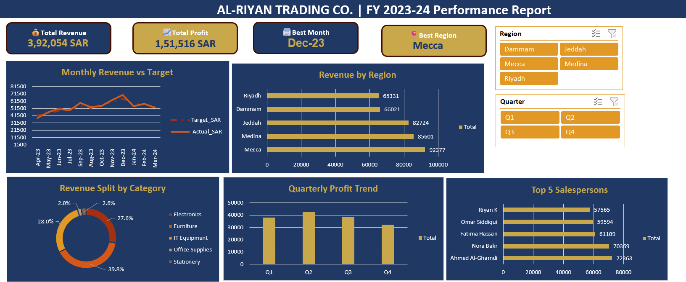
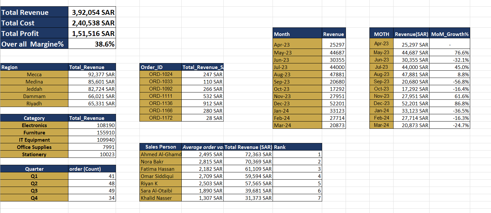
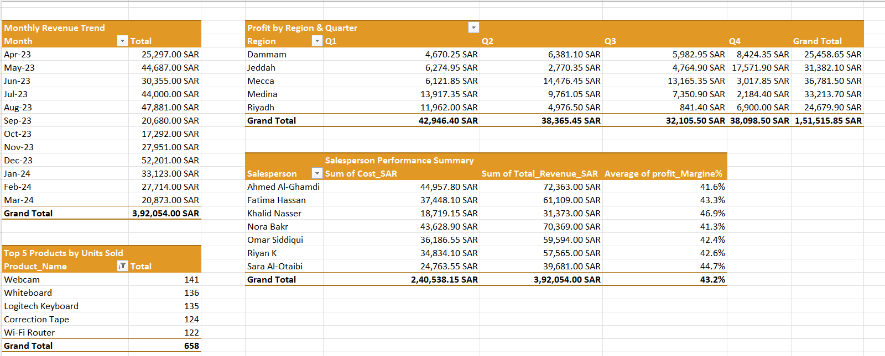

# 📊 AL-RIYAN TRADING CO. | Excel Portfolio Project
### FY 2023-24 Sales Performance Analysis Dashboard

-006C35?style=for-the-badge)

---

## 🖥️ Dashboard Preview

---

## 🏢 Project Overview

This project is a full end-to-end **Sales Performance Analysis** built in Microsoft Excel for **AL-RIYAN TRADING CO.**, a fictional trading company based in **Saudi Arabia (KSA)**. The dataset covers **FY 2023-24 (April 2023 – March 2024)** with **172 sales transactions** across 5 KSA regions, 7 salespersons, and 5 product categories.

The goal was to simulate a real-world business analyst workflow — from raw data cleaning to an interactive executive dashboard — using only Microsoft Excel.

---

## 🎯 Objectives

- Clean and structure raw sales data for analysis
- Build formula-driven analysis using SUMIF, AVERAGEIF, COUNTIF, VLOOKUP, RANK
- Create pivot tables to summarize business performance
- Design an interactive dashboard with KPI cards, charts, and slicers
- Generate actionable business insights from the data

---

## 🗂️ File Structure

| Sheet | Description |
|---|---|
| `RAW_Sales_Data` | 172 cleaned transaction records with 15 columns |
| `Analysis` | Formula-based KPI summary, regional breakdown, MoM growth |
| `Pivot_Analysis` | 4 pivot tables with slicers |
| `DASHBOARD` | Interactive executive dashboard |
| `Monthly_Targets` | Monthly revenue targets vs actuals |
| `Expenses_Data` | Supporting expense data |

---

## 🧹 Phase 1 — Data Cleaning & Preparation

**Dataset:** 172 rows × 15 columns

| Column | Description |
|---|---|
| Order_ID | Unique transaction identifier |
| Date / Month / Quarter | Time dimensions (April-start FY) |
| Salesperson / Region | Sales dimensions |
| Product_Category / Product_Name | Product dimensions |
| Units_Sold / Unit_Price_SAR | Transaction details |
| Total_Revenue_SAR | Units × Price |
| Cost_SAR / Profit_SAR | Cost and profitability |
| Profit_Margin% | Profit ÷ Revenue |
| Performance_Flag | High / Low flag based on margin threshold |

**Steps completed:**
- Removed duplicates and verified zero blank cells
- Added calculated columns: Profit_SAR, Profit_Margin%, Performance_Flag
- Applied April-start fiscal year quarter logic (Q1=Apr–Jun, Q2=Jul–Sep, Q3=Oct–Dec, Q4=Jan–Mar)
- Created named range `SalesData` covering full dataset
- Formatted all currency columns in SAR

---

## 📐 Phase 2 — Analysis With Formulas

| Task | Formula Used | Result |
|---|---|---|
| Total Revenue | SUM | 3,92,054 SAR |
| Total Cost | SUM | 2,40,538 SAR |
| Total Profit | SUM | 1,51,516 SAR |
| Overall Margin% | Profit ÷ Revenue | 38.6% |
| Revenue by Region | SUMIF | Mecca leads at 92,377 SAR |
| Revenue by Category | SUMIF | Furniture leads at 1,55,910 SAR |
| Avg Order Value | AVERAGEIF | Ahmed Al-Ghamdi: 2,495 SAR |
| Orders by Quarter | COUNTIF | Q3 highest with 49 orders |
| Order Lookup | VLOOKUP / XLOOKUP | Dynamic Order_ID lookup |
| Salesperson Rank | RANK | Ahmed Al-Ghamdi ranked #1 |
| MoM Revenue Growth | Custom Formula | Peak growth: Dec-23 at +86.8% |

---

## 📊 Phase 3 — Pivot Tables

| Pivot Table | Description | Key Finding |
|---|---|---|
| PT1 — Monthly Revenue Trend | Revenue by Month (Apr→Mar) | Dec-23 peak at 52,201 SAR |
| PT2 — Profit by Region & Quarter | Profit breakdown across 5 regions × 4 quarters | Mecca Q2 highest at 14,476 SAR |
| PT3 — Top 5 Products by Units Sold | Ranked product performance | Webcam #1 with 141 units |
| PT4 — Salesperson Performance | Revenue, Cost, Profit, Margin% per salesperson | Ahmed Al-Ghamdi leads at 72,363 SAR |

**Features:**
- Region Slicer connected to pivot tables
- Quarter Slicer connected to pivot tables
- Consistent professional Gold + Dark Blue formatting

---

## 📈 Phase 4 — Charts (5 Charts)

| Chart | Type | Key Insight |
|---|---|---|
| Monthly Revenue vs Target | Line Chart | Actual exceeded target in 7 of 12 months |
| Revenue by Region | Horizontal Bar | Mecca is top region (92,377 SAR) |
| Revenue by Category | Donut Chart | Furniture dominates at 39.8% share |
| Quarterly Profit Trend | Column Chart | Q2 was most profitable (38,365 SAR) |
| Top 5 Salespersons | Horizontal Bar | Ahmed Al-Ghamdi leads at 72,363 SAR |

---

## 🖥️ Phase 5 — Interactive Dashboard

**Design Theme:** Dark Blue (#1F3864) + Gold (#C9A84C)

### KPI Cards

| Card | Value |
|---|---|
| 💰 Total Revenue | 3,92,054 SAR |
| 📈 Total Profit | 1,51,516 SAR |
| 📅 Best Month | Dec-23 |
| 📍 Best Region | Mecca |

**Dashboard Features:**
- 4 KPI summary cards with icons
- 5 interactive charts
- Region slicer (filter by Dammam, Jeddah, Mecca, Medina, Riyadh)
- Quarter slicer (filter by Q1, Q2, Q3, Q4)
- Gridlines and headers removed for clean presentation
- Consistent Dark Blue + Gold branding throughout

---

## 🔍 Key Business Insights

1. **Furniture dominates revenue** — contributing 39.8% of total revenue (1,55,910 SAR), making it the highest-performing product category for FY 2023-24.

2. **Mecca is the strongest KSA region** — generating 92,377 SAR in revenue, significantly ahead of Medina (85,601 SAR) and Jeddah (82,724 SAR).

3. **December 2023 was the peak month** — with 52,201 SAR in revenue and an exceptional +86.8% MoM growth, driven by year-end purchasing activity.

4. **Ahmed Al-Ghamdi is the top salesperson** — achieving 72,363 SAR in total revenue with an average order value of 2,495 SAR, ranked #1 among 7 salespersons.

5. **Q2 was the most profitable quarter** — generating 38,365 SAR in profit across all 5 KSA regions.

6. **Overall business exceeded annual target** — Total actual revenue of 6,49,800 SAR surpassed the target of 6,42,000 SAR by 7,800 SAR (1.2% over target). ✅

---

## 🛠️ Skills Demonstrated

| Skill | Details |
|---|---|
| Data Cleaning | Duplicate removal, blank handling, data typing, named ranges |
| Excel Formulas | SUMIF, AVERAGEIF, COUNTIF, VLOOKUP, XLOOKUP, RANK, INDEX/MATCH |
| Pivot Tables | Multi-dimensional analysis with Region & Quarter slicers |
| Data Visualization | 5 chart types — Line, Bar, Donut, Column |
| Dashboard Design | KPI cards, interactive filters, professional Dark Blue + Gold theme |
| Business Context | KSA market, SAR currency, 5-region sales analysis, April-start FY |

---

## 📁 How to Use This File

1. Download `AlRiyan_Trading_Portfolio_RawData.xlsx`
2. Open in Microsoft Excel (2016 or later recommended)
3. Navigate to the `DASHBOARD` sheet
4. Use **Region** and **Quarter** slicers to filter the view
5. Explore individual sheets for detailed analysis

---

## 👨‍💼 About the Author

**Muhammed Riyan K**
M.Com Student | Central University of Rajasthan (2024–2026)
Aspiring Data Analyst | GCC / KSA Market Focus

---

*This project was built as part of an Excel portfolio to demonstrate data analysis skills for KSA/GCC job market readiness.*
